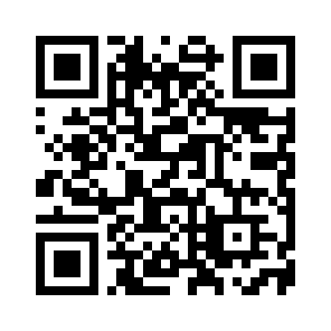

# Smooth QR

A smooth QR code generator with rounded edges, for my videos and streams.

This Python script generates QR codes with rounded corners. It can save the generated QR code to a file. The intention of this project is to provide an easy way to generate aesthetically pleasing QR codes for my videos and streams.

## Features

Generates QR codes with custom URLs and rounded corners.

## Example

Here's an example of a generated QR code:



## Requirements

- Python 3.x
- qrcode
- Pillow
- typer

## Installation

1. Clone the repository:

    ```sh
    git clone https://github.com/DiogoNeves/smooth-qr.git
    cd smooth-qr
    ```

2. Install the required packages:

    ```sh
    pip install qrcode[pil] Pillow typer[all]
    ```

## Usage

To generate a QR code and save it to the default file `qrcode.png`:

```sh
python smooth_qr.py -- https://www.youtube.com/c/DiogoNeves
```

To generate a QR code and save it to a specified file:

```sh
python smooth_qr.py -- https://www.youtube.com/c/DiogoNeves custom_filename.png
```

## License

This project is licensed under the MIT License. See the [LICENSE](LICENSE) file for details.

## Contributing

Feel free to submit issues or pull requests. Contributions are welcome!

## Author

Diogo Neves
